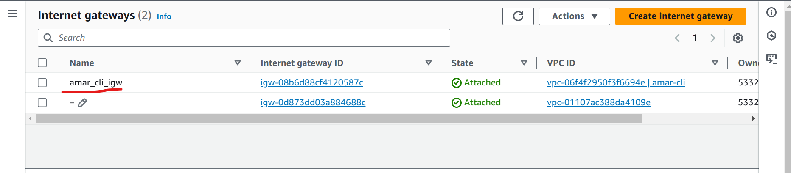

### CLI - Task

Install and Setup AWS cli on Local machine
Config PA credentials

- Create VPC using cli

- create Pub and Pvt subnets

- create IGW

- Attach IGW to VPC

- Create Pub and PVT RT

- Attach Pub sub to Pub rt

- Attach Pvt Sub to Pvt rt
- Attach IGW to Pub RT

- Create Sg for ssh // http
- Create a Ec2 in Pub Sub
- Create a Ec2 in Pvt Sub 
