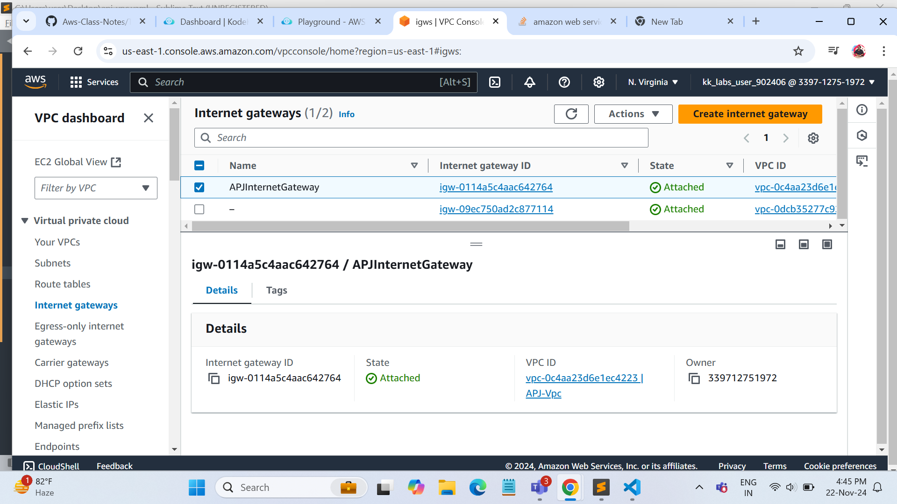
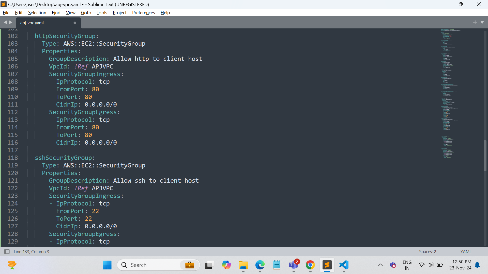
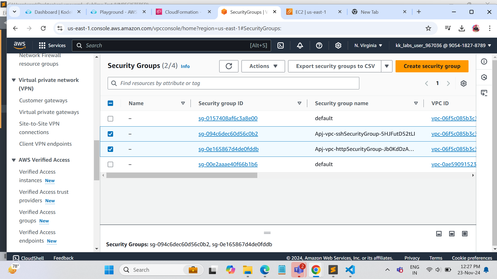

## Here we are creating network with cloudFormation

ICreate tje below listed resources, with AWS - Cloudformation !!

### Create VPC using cloudFormation 

###  create Pub and Pvt subnets

### create IGW

### Attach IGW to VPC

- Create Pub and PVT RT

### Attach Pub sub to Pub rt

### Attach Pvt Sub to Pvt rt

### Attach IGW to Pub RT

### Create Sg for ssh // http

### Create a Ec2 in Pub Sub

### Create a Ec2 in Pvt Sub
 

